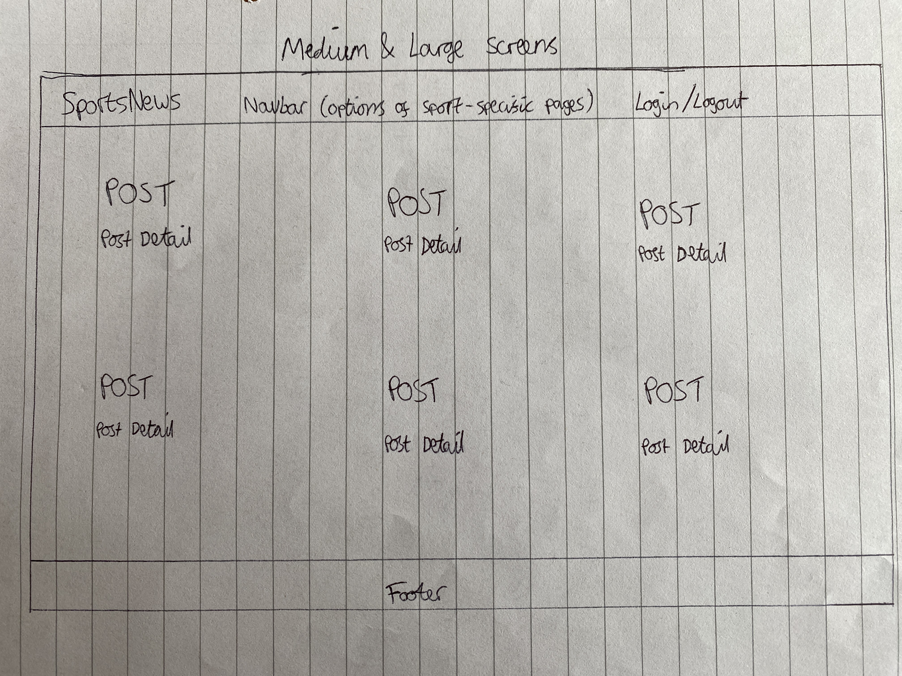
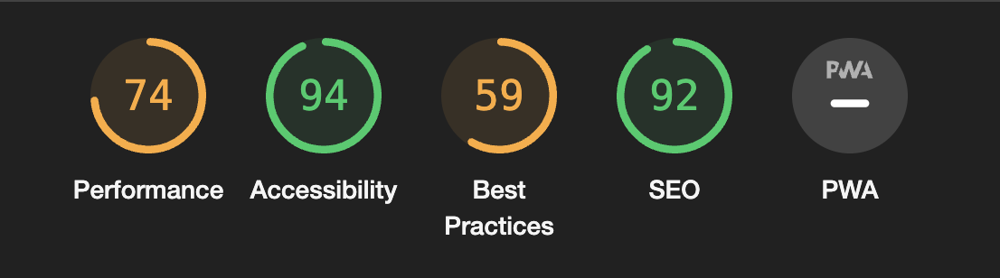

# Sports News Site

Sports news site is a site that aims to provide users with access to recent news articles from three different sports, which are football, tennis and boxing.
The site offers users a chance to register an account, and therefore to login and logout of the site whenever they choose.
When logged in, users are able to view posts uploaded by other users, which include information such as the user's name, and the time that the post was created.
Users of the site can also leave comments on other posts, and can see whether their comments have been approved by the site admin or are awaiting approval.
The site admin is able to manage all posts by creating, reading, updating or deleting them.
The site admin is also able to manage all user comments by choosing whether or not to approve them.

## Features

### Existing Features

- __Navigation Bar__

  - Featured on all pages, the fully responsive navigation bar includes links to the Logo, Home page, About, Football, Tennis and Boxing pages and is identical in each page to allow for easy navigation.
  - This section will allow the user to easily navigate from page to page across all devices without having to revert back to the previous page via the ‘back’ button.

- __The Home Page__

  - The home page features a display of posts from all three sports, displayed in order of most recent to least recent.

- __The Football Page__

  - The football page features all posts filtered for the sport category of football.

- __The Tennis Page__

  - The tennis page features all posts filtered for the sport category of tennis.

- __The Boxing Page__

  - The boxing page features all posts filtered for the sport category of boxing.

- __The Register Page__

  - The register page features a form for users to sign up and create a user account with the site.

- __The Login Page__

  - The login page features username and password input fields for users to login to their account.

- __The Logout Page__

  - The logout page features a message asking users to confirm if they wish to logout.

- __The Footer__ 

  - The footer section includes placeholder (inactive) links to the relevant social media sites for the site.
  - The footer is valuable to the user as it encourages them to keep connected via social media.

### Features Left to Implement

- There are many features I would like to implement in this site in the future, firstly is content for the about page which hasn't yet been added.
- The ability for users to add and delete their own posts to the site.
- The ability for users to like/give a thumbs up to each other's posts and comments.
- More posts added for each sport.
- Additional pages of the site for different content, e.g. videos or photo galleries etc.
- A confirmation email sent to users when they create an account.
- Additional information about each aspect of the site included in the readme.md file.
- Screenshots and images in the readme.md file.
- Automated testing files to ensure everything is working as it should be.
- Detailed docstrings on python views and functions to explain what their purposes are.

## Design Process

- I based the design of this site partly on the code institute django blog project, and partly on the look and layout of various similar sports sites on the internet.
- A key part of the design was to ensure that users had an easy and effective way of navigating to the different sport-specific pages, via clearly labelled links in the navbar.
- Below are two hand-drawn basic wireframes from the beginning of the design process, outlining the desired layout of the homepage and sport-specific post pages on small screens, as well as medium and large screens.

## Credits

### Content

- This project was built using the steps from the code institute django codestar blog walkthrough project.
- I followed the steps of the walkthrough project for guidance on setting up the site, and edited the post model so that I could filter the posts by each sport.
- Once completed, I edited some of the text and background colors in the css file, and created additional views, urls, and templates for the pages displaying the posts of each individual sport.

### Media

- The images were taken from google images.
- The sports news articles were taken from various sports sites, including bbc.co.uk/sport, atptour.com, and boxingnewsonline.net.

### Installs

Packages installed for this project are:

- django 4.2.1
- gunicorn 20.1.0
- dj-database-url 0.5.0
- psycopg2 2.9.10
- django-summernote 0.8.20.0
- whitenoise 5.3.0
- django-allauth 0.57.2
- django-crispy-forms 2.3
- crispy-bootstrap5 0.7
- cloudinary 1.36.0
- dj3-cloudinary-storage 0.0.6
- urllib3 1.26.20

## Testing

### Manual Testing

- All manual tests were carried out by logging in as a user or a site admin, depending on the test, and navigating through the site to ensure each section works as intended.
- I have manually tested the core application functionality to ensure that each feature of the site meets the acceptance criteria in the user stories as follows:
  - I have confirmed that users can register an account using an email, and can then successfully log in and out of their account.
  - I have confirmed that logged in users can comment on a post.
  - I have confirmed that users can click on a post to view a detailed page about the single post.
  - I have confirmed that users can add, modify or delete their own comments on a post.
  - I have confirmed that users can view a paginated list of posts on the homepage.
  - I have confirmed that logged-in users are able to add and delete their own posts to the site.
  - I have confirmed that users can click on the links to the other pages in the navbar, to be able to filter the posts for a specific sport.
  - I have confirmed that the site admin can approve or disapprove comments.
  - I have confirmed that the site admin can create draft posts.
  - I have confirmed that the site admin can create, read, update and delete posts and comments from the site.

### Validator Testing 

- HTML
  - A few minor errors were returned when passing some HTML files through the official W3C HTML validator.
- CSS
  - No errors were found when passing through the official W3C Jigsaw CSS validator.
- Accessibility
  - I confirmed that the colours and fonts chosen are easy to read and accessible by running it through lighthouse in devtools.

## Deployment

- The site was deployed to Heroku. The steps to deploy are as follows: 
  - Create new app in Heroku, and connect it to the Github repository for the site.
  - Create env.py file and set values of environment variables (database url, secret key and cloudinary url).
  - Add env.py file to .gitignore file.
  - Set config variables in Heroku settings tab.
  - Set DEBUG=False in settings file.
  - Create runtime.txt file.
  - Commit and push all changes to Github.
  - Navigate to deploy tab in Heroku, and click 'Deploy Branch' button.